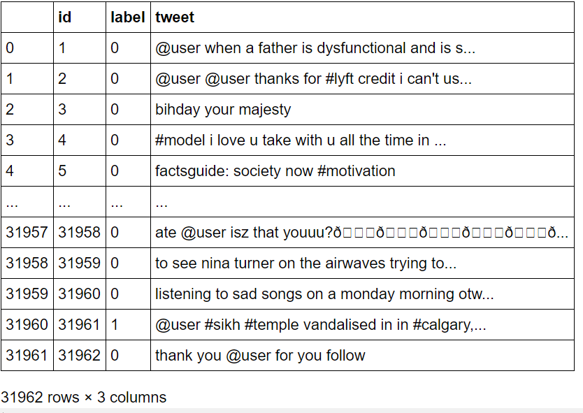
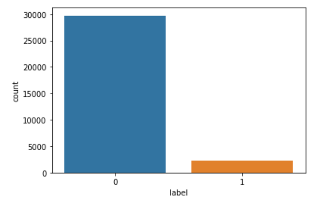
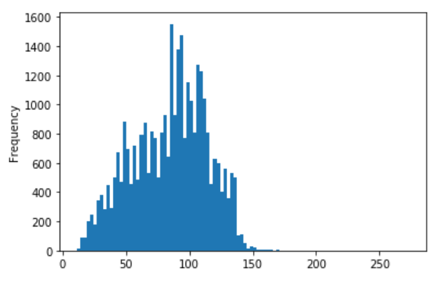
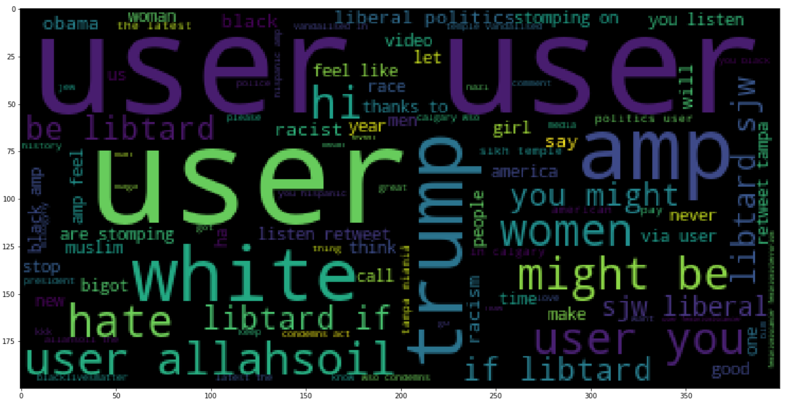
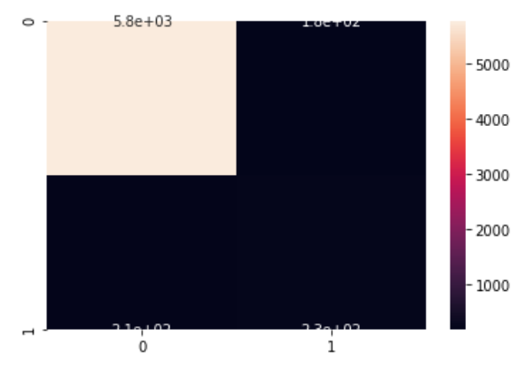

# Information about dataset  
  

It has the following input features : id, label, tweet of 30000 twitter users  
Label 0 - Positive tweets  
Label 1 - Negative tweets  
### Count vs Label
  
The number of negative tweets are very less compared to number of positive tweets
### Tweet length vs Frquency
 
Most of the tweets are ~85 characters long  
### Wordcloud
 
### Confusion matrix

